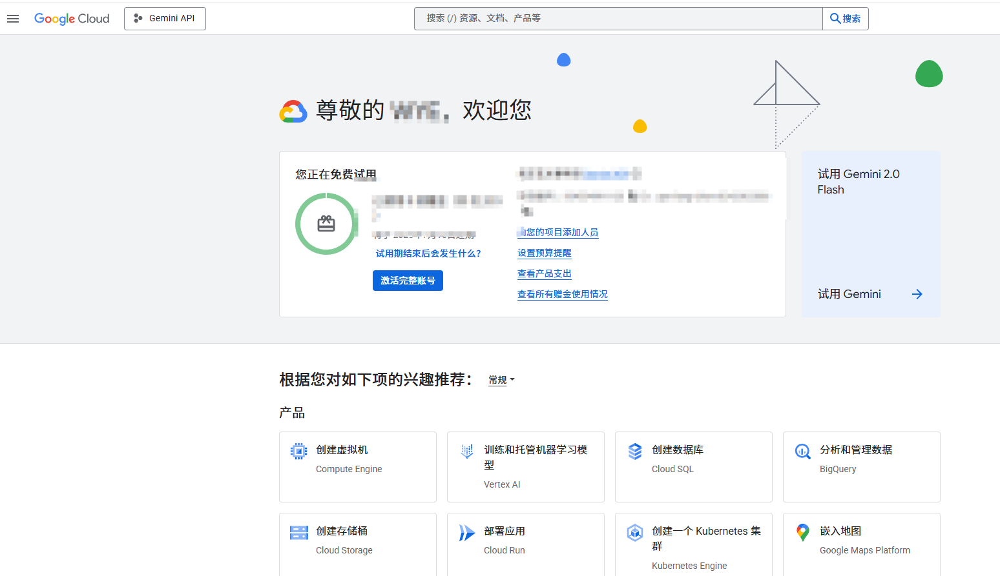
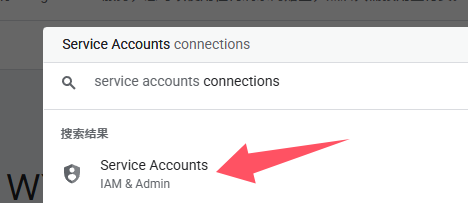
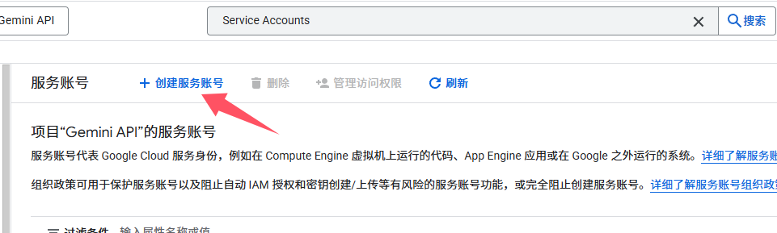
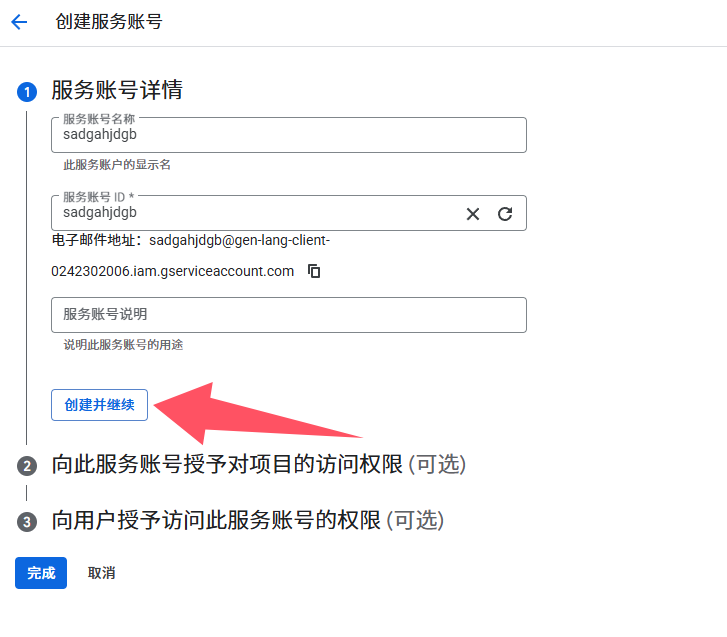
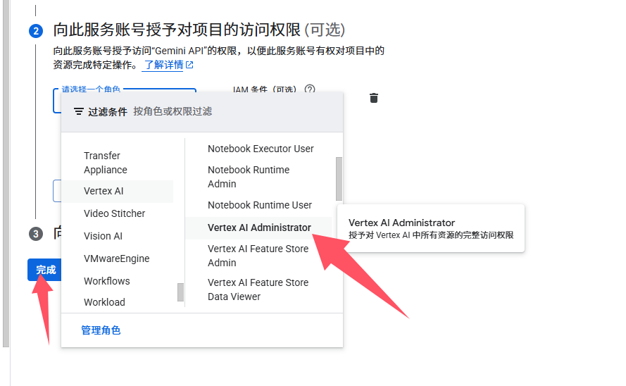
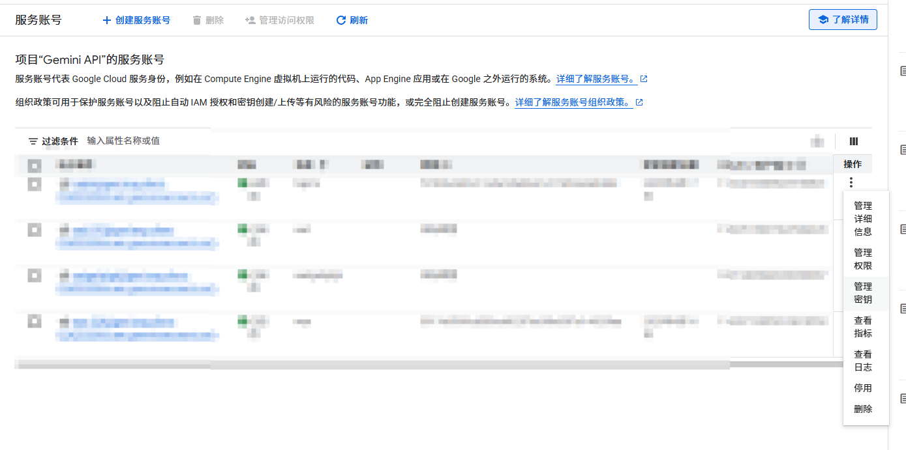
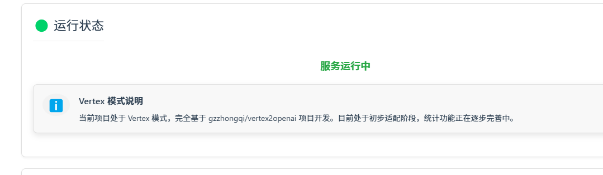

# Vertex AI 配置指南
## 0. 前置条件与风险提示
1. Google Cloud Platform (GCP) 要求用户绑定有效的国际支付方式以进行计费，在配置前确保你已经绑定相关信用卡
2. 不建议使用虚拟信用卡进行支付验证，可能导致账户被GCP风控系统标记并限制
3. 建议在部署前充分了解GCP的服务条款、计费规则及API使用限制
## 1. 获取API密钥
1. 访问 [Google Cloud Console](https://console.cloud.google.com/)
2. 在上方搜索栏中搜索Service Accounts并选择
3. 点击创建服务账号
4. 账号名称随意，输入后点击创建并继续
5. 在选择角色中，如图所示，在vetrex ai中找到Vertex Al Administrator，然后点击完成
6. 找到刚刚创建的账号，在左侧点开菜单栏，选择秘钥管理
7. 点击添加键-创建新秘钥-json格式，创建成功后会自动下载json格式的秘钥
8. 在上方搜索vertex api，点击进入并选择启用vertex api
## 2. 在hajimi中使用
- 参照huggingface教程，在hajimi中新建环境变量`ENABLE_VERTEX`，并将value设置为true
- 在hajimi中新建变量`GOOGLE_CREDENTIALS_JSON`，将value值设置为你刚刚下载的json的内容
- 等待项目重新部署，看到如图所示界面，即为正常启用vertex模式

## 3. 故障排除
如果遇到权限相关的问题：
1. 确认Service Account是否具有正确的权限
2. 检查API密钥文件是否正确放置
3. 验证项目是否已启用Vertex AI API
4. 检查Google Cloud Console中的配额限制
