# 使用zeabur搭建Gemini 轮询教程

*由墨舞ink编写*

## 一、准备工作

### 1.1 下载项目
从 releases 下载最新版本，并解压到任意目录。

## 二、在zeabur上搭建部署

### 2.1 打开zeabur服务器的控制台，进入项目界面，点击新建服务
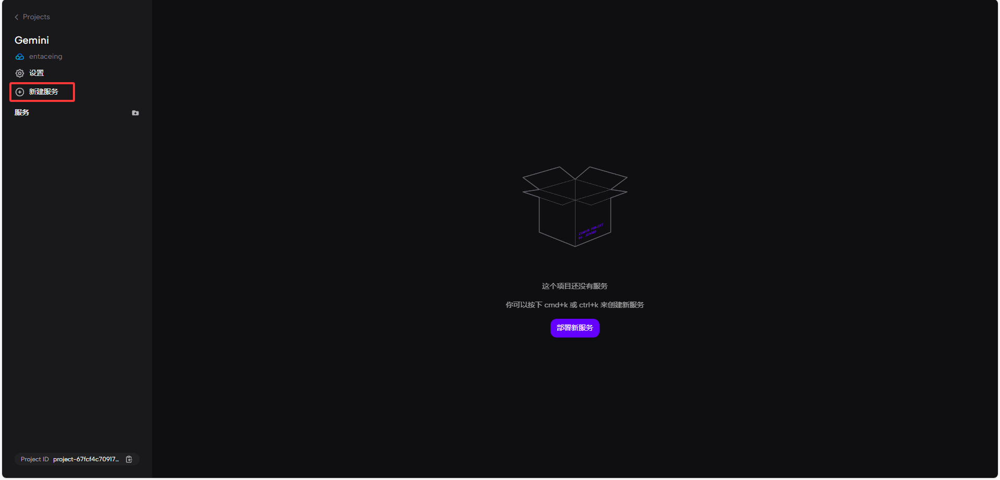

### 2.2 点击本地项目
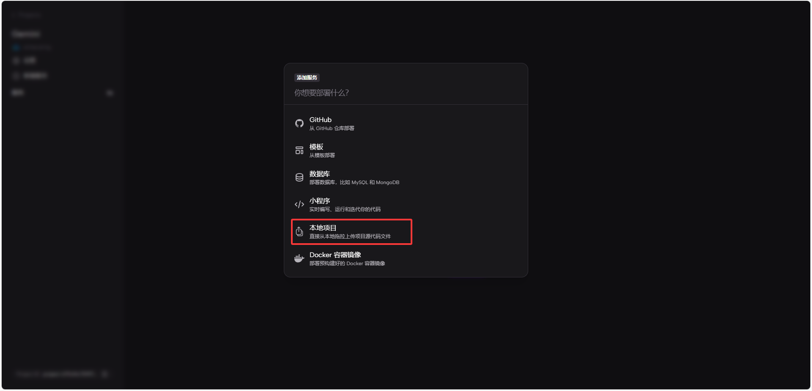
### 2.3 点击上传
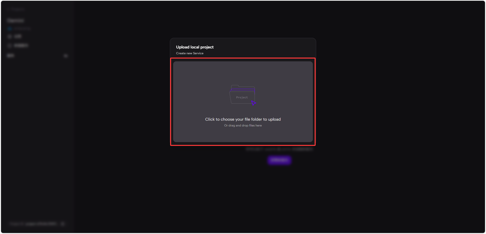
### 2.4 选择项目文件夹
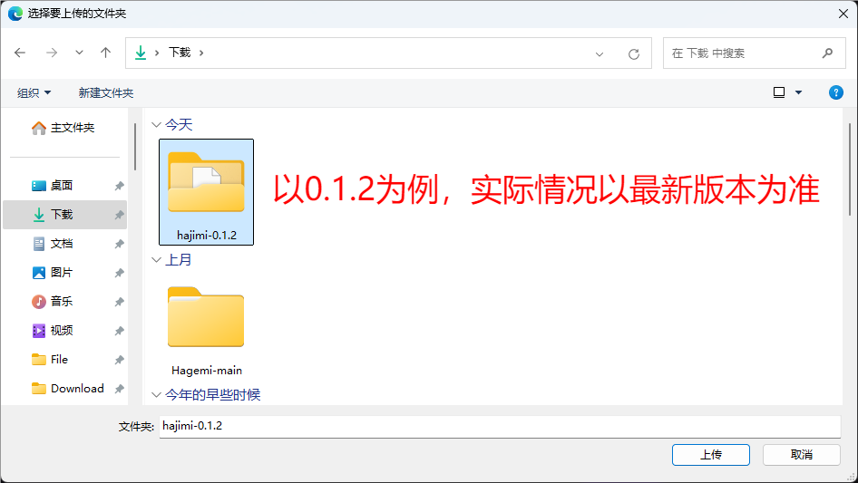
### 2.5 点击部署
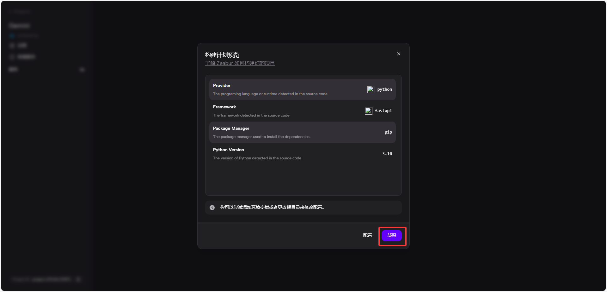
### 2.6 部署成功
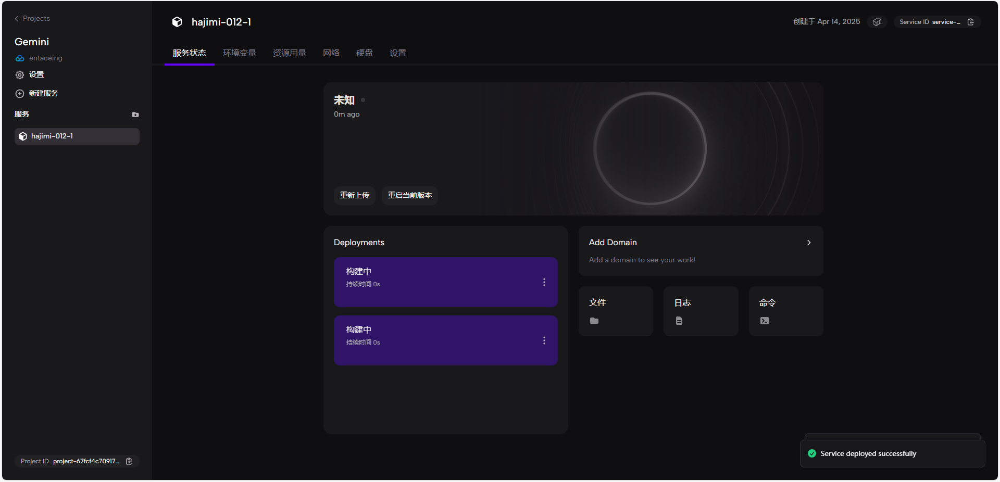
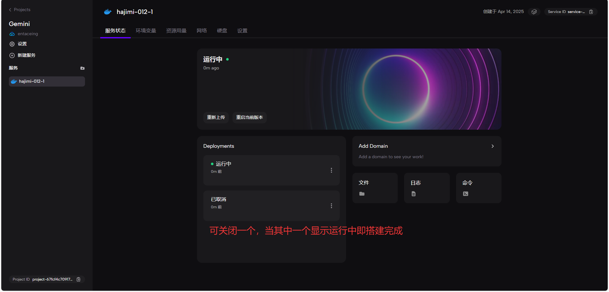
## 三、进行配置文件修改

### 3.1 点击环境变量 选择编辑原始环境变量
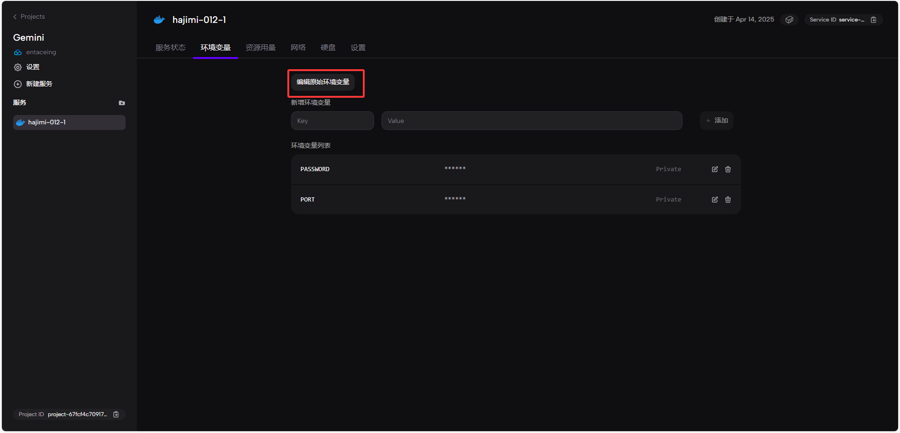
### 3.2 粘贴并保存以下内容
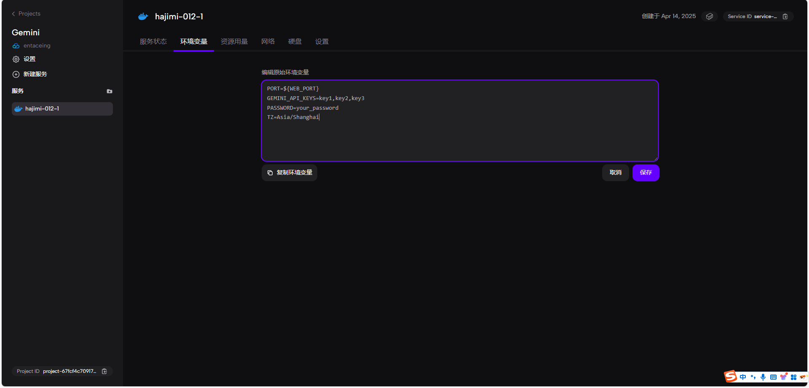
```
PORT=${WEB_PORT}
GEMINI_API_KEYS=key1,key2,key3
PASSWORD=your_password
TZ=Asia/Shanghai
```

按需修改上述值，注意key必须使用英文逗号间隔。

### 3.3 点击网络，开放端口
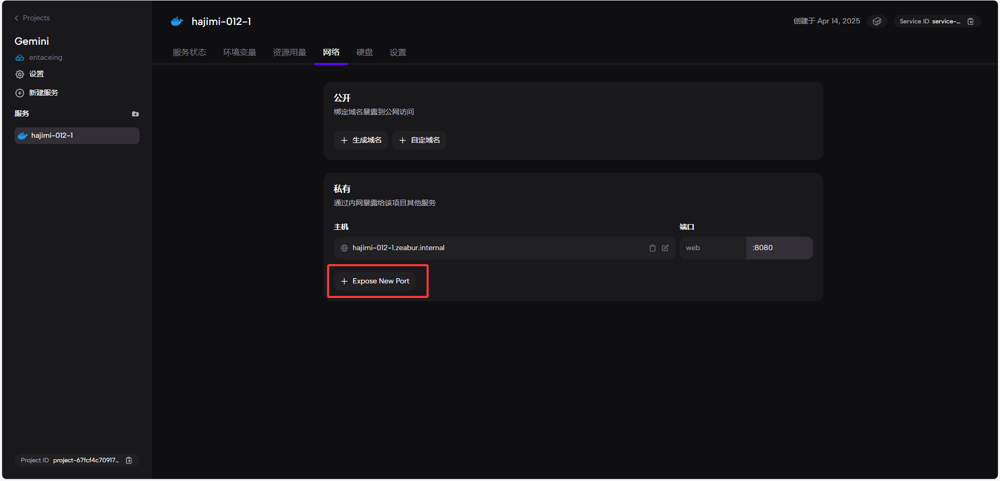
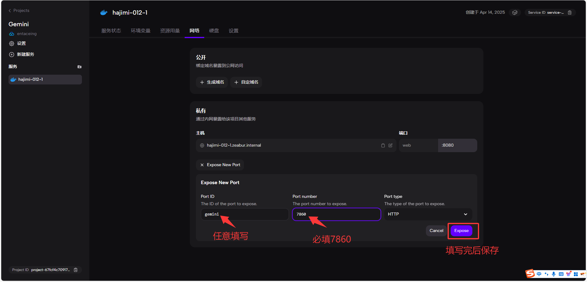
### 3.4 生成域名
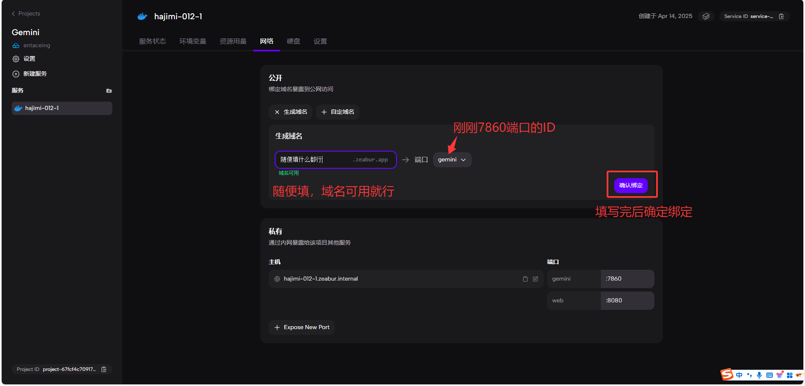
### 3.5 等待域名绑定完成后重启
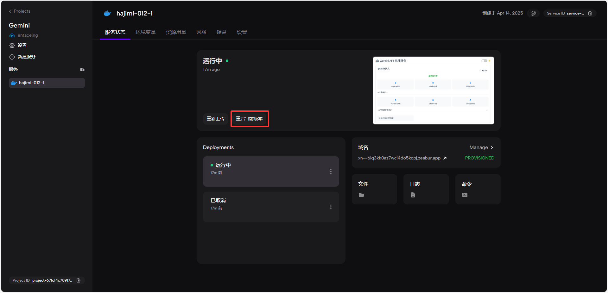
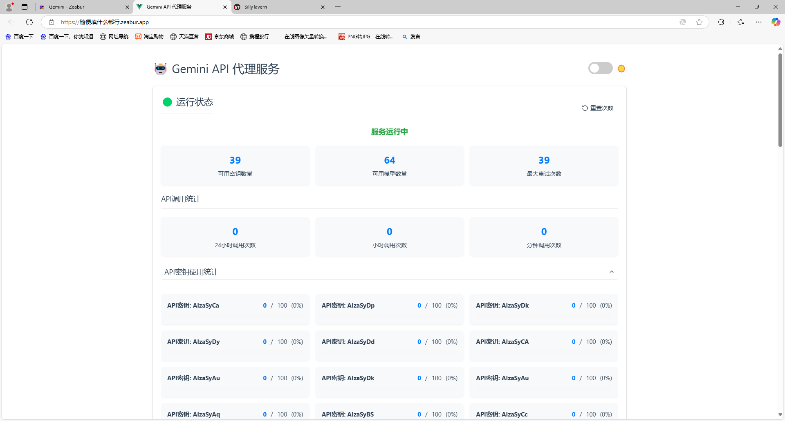
## 部署完毕

### 注意事项：

1. 若酒馆和Gemini轮询没有同时搭建在zeabur服务器
   - 则反代地址为`http://你自定义的域名.zeabur.app/v1`

2. 若酒馆和Gemini轮询部署在同一个zeabur服务器
   - 则反代地址为`http://主机:7860/v1`
   - 主机为：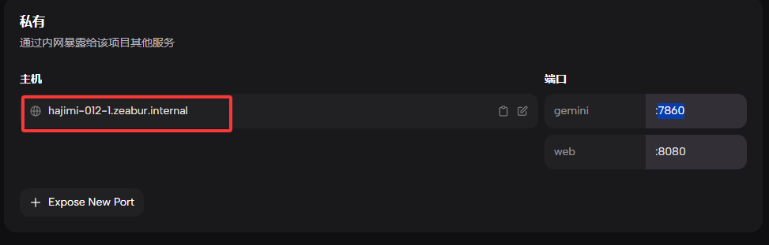

3. 酒馆内API秘钥即为`PASSWORD=your_password`中你填写的内容